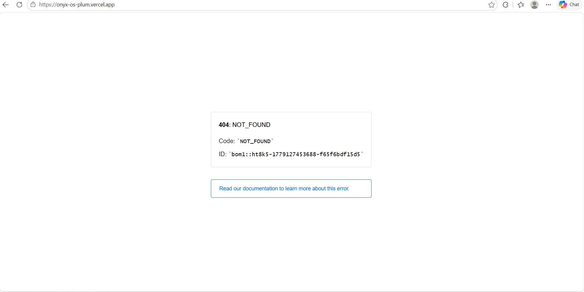

# Onyx OS — Master Context Document (for Anti-Gravity / AI agents)

> **Last updated:** 2026-05-18  
> **Project path:** `c:\Users\laksh\Desktop\Tracker`  
> **Current phase:** Phase 2 COMPLETE — Full platform with live data

---

## 1. What is Onyx OS?

AI-native developer operating system — Bloomberg Terminal density meets Linear/Vercel aesthetics. **Obsidian-UI**: ultra-dark, brutalist, keyboard-first.

---

## 2. Tech Stack

| Layer | Technology |
|-------|------------|
| Framework | Next.js 15 App Router (`src/`) |
| Language | TypeScript strict |
| Styling | Tailwind + Obsidian tokens |
| State | Zustand + TanStack Query |
| DB | Prisma 6 + **SQLite** (`file:./dev.db`) |
| Auth | Cookie session (`onyx_session`, HMAC signed) |

---

## 3. Status — FULL SITE COMPLETE

### ✅ Implemented
- **Auth:** Auto-login `operator@onyx.dev` via `AuthBootstrap`
- **Database:** SQLite, seeded demo data (`npm run db:seed`)
- **Dashboard:** Live stats, ratings, recent sessions, charts
- **DSA Vault:** CRUD problems, toggle solved, add problems
- **CP Matrix:** Platform ratings + handle editor
- **Roadmap Engine:** Interactive tree, cycle node status
- **Career Radar:** Goals CRUD, status toggle
- **Resume Intelligence:** Section editor, re-analyze scoring
- **Opportunity Radar:** Match table with links
- **Analytics:** Module + daily bar charts
- **Settings:** Preferences (density, keyboard, palette)
- **API routes:** `/api/auth|dashboard|dsa|profile|roadmap|career|resume|opportunities|analytics|ai`
- **Command palette:** Search, nav, sidebar toggle (Ctrl/Cmd+K)

### ⏳ Future enhancements
- Production PostgreSQL migration
- Real OAuth (Google/GitHub)
- Live LLM providers (Gemini/OpenAI/Claude) — stubs exist
- External platform API sync (LeetCode/Codeforces)
- Resizable panes

---

## 4. How to Run

```powershell
cd c:\Users\laksh\Desktop\Tracker
copy .env.example .env   # if missing
npm install
npx prisma db push
npm run db:seed
npm run dev              # http://localhost:3000
```

Demo user: **operator@onyx.dev** (auto session on first load)

---

## 5. API Endpoints

| Route | Methods | Purpose |
|-------|---------|---------|
| `/api/auth` | GET, POST, DELETE | Session / login / logout |
| `/api/dashboard` | GET | Aggregated stats |
| `/api/dsa` | GET, POST, PATCH, DELETE | DSA vault |
| `/api/profile` | GET, PATCH | Platform + preferences |
| `/api/roadmap` | GET, PATCH | Roadmap nodes |
| `/api/career` | GET, POST, PATCH, DELETE | Career goals |
| `/api/resume` | GET, PATCH, POST | Resume sections + analyze |
| `/api/opportunities` | GET, POST, DELETE | Opportunities |
| `/api/analytics` | GET | Study analytics |
| `/api/ai` | GET, POST | AI analyze (resume uses local scoring) |

All require session cookie except auth POST (creates session).

---

## 6. Module → File Map

| Route | Module component |
|-------|------------------|
| `/` | `src/modules/dashboard/DashboardModule.tsx` |
| `/dsa-vault` | `src/modules/dsa-vault/DSAVaultModule.tsx` |
| `/cp-matrix` | `src/modules/cp-matrix/CPMatrixModule.tsx` |
| `/roadmap` | `src/modules/roadmap/RoadmapModule.tsx` |
| `/career` | `src/modules/career/CareerModule.tsx` |
| `/resume` | `src/modules/resume/ResumeModule.tsx` |
| `/opportunities` | `src/modules/opportunities/OpportunitiesModule.tsx` |
| `/analytics` | `src/modules/analytics/AnalyticsModule.tsx` |
| `/settings` | `src/modules/settings/SettingsModule.tsx` |

Server logic: `src/server/services/*.service.ts`

---

## 7. Key Architecture

```
AuthBootstrap → auto POST /api/auth if no session
AppShell → Sidebar + Topbar + pages
apiFetch() → standardized APIResponse<T>
Prisma → SQLite dev.db
```

**Session:** `src/lib/auth/session.ts` — HMAC cookie, `SESSION_SECRET` in `.env`

**Client API:** `src/lib/api/client.ts` — `apiFetch<T>()`

---

## 8. Engineering Rules

1. Strict TypeScript, no `any`
2. Obsidian-UI only — see `docs/DESIGN-SYSTEM.md`
3. No LLM calls from components — use `services/ai.ts`
4. Use `apiSuccess` / `apiError` in routes
5. Soft delete on all models (`isDeleted`)
6. Update `docs/DEVELOPMENT-LOG.md` after changes

---

## 9. Related Docs

- `docs/DEVELOPMENT-LOG.md` — changelog
- `docs/ARCHITECTURE.md` — system design
- `docs/DESIGN-SYSTEM.md` — UI tokens
- `docs/FILE-REFERENCE.md` — file index
- `docs/API-CONTRACTS.md` — types & API shapes
- `onyx-architecture.md` — product laws

---

*Phase 2 complete. Site is functional end-to-end with seeded data.*
